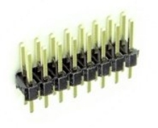
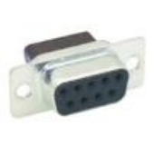
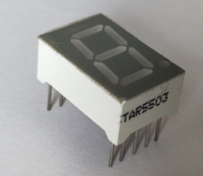

# **8086 16-BIT MICROPROCESSOR	BOARD**

User Manual	

Authors:  Marshall Hageman and Toluwanimi Oyediran

UNIVERSITY OF MARYLAND, BALITIMORE COUNTY

Rev: -

Published:  December 2, 2018

**

**

**

**

**

**

**

**

**

# **CONTENTS**
[8086 16-Bit Microprocessor	Board	0](#_toc531558828)

[1 circuit card assembly (CCA) Overview	2](#_toc531558829)

[1.1 Introduction	2](#_toc531558830)

[1.3 Block Diagram	3](#_toc531558831)

[2 THE 8086 Microprocessor and Buffer Chips	5](#_toc531558832)

[2.1 8086 Device Description	5](#_toc531558833)

[2.2 Demultiplexing and Address Buffers	6](#_toc531558834)

[2.3 Data Bus and Control Buffers	7](#_toc531558835)

[3 The 8284A Clock Generator	8](#_toc531558836)

[3.1 Device Description	8](#_toc531558837)

[3.2 RESET Circuit	9](#_toc531558838)

[4 The 8255 Programmable peripheral interface	10](#_toc531558839)

[4.1 Device Description	10](#_toc531558840)

[4.2 Connecting the 8255	10](#_toc531558841)

[5 The 8259A Programmable Interrupt Controller	10](#_toc531558842)

[5.1 Device Description	10](#_toc531558843)

[5.2 Connecting the 8259A	11](#_toc531558844)

[6 The 8254 Programmable Interval Timer	12](#_toc531558845)

[6.1 Timing Device Description	12](#_toc531558846)

[6.2 Connecting the 8254	12](#_toc531558847)

[7 the 8279 Programmable Keyboard/Display Interface	13](#_toc531558848)

[7.1 8279 Description	13](#_toc531558849)

[7.2 Interfacing with a 4x4 Keyboard Matrix	14](#_toc531558850)

[7.5 Command Words to Program the 8279	14](#_toc531558851)

[7.6 Assembly Implementation	14](#_toc531558852)

[8 the 16550 UART and Serial Interface	15](#_toc531558853)

[8.1 16550 Device Description	15](#_toc531558854)

[8.4 Connecting the UART	16](#_toc531558855)

[8.5  MAX-235 Device Description and Implementation	16](#_toc531558856)

[9 The 16L8 Programmable Logic Device (PLD)	18](#_toc531558857)

[9.1   16L8 PLD Description	18](#_toc531558858)

[9.2 Programming the 16L8	19](#_toc531558859)

[10 storage Devices and Memory Architecture	22](#_toc531558860)

[10.1 CY7C199 Static RAM (SRAM) Description	22](#_toc531558861)

[10.2 Interfacing the SRAM with the Microprocessor	23](#_toc531558862)

[10.4 28F010 CMOS Flash Memory Description	23](#_toc531558863)

[10.5 Flash Interface to the Microprocessor	24](#_toc531558864)

[10.6 Addressing of Flash and SRAM	24](#_toc531558865)

[11 External Headers and Connectors	24](#_toc531558866)

[11.1 8255 I/O Header (30 pins)	25](#_toc531558867)

[11.2 8254 I/O Header (30 pins)	25](#_toc531558868)

[11.3 Interrupt (4 pin) Header with the 8259	25](#_toc531558869)

[11.4 Address, Data, and Control Bus (60 pin External Header)	25](#_toc531558870)

[11.5 Serial Interface DB-9 Connector	25](#_toc531558871)

[11.6 Power Interface – Terminal	27](#_toc531558872)

[12 Display and Miscellaneous components	27](#_toc531558873)

[12.1 Liquid crystal display (LCD)	27](#_toc531558874)

[12.2 Seven Segment LED	27](#_toc531558875)

[12.3 Single LEDs	29](#_toc531558876)

[12.4 Dual in-line package (DIP) Switches	30](#_toc531558877)

[13 Appendix	31](#_toc531558878)

[13.1 Schematics	31](#_toc531558879)

[13.2 PCB Board Layout	40](#_toc531558880)

[13.3 Bill of Materials	41](#_toc531558881)

# **1 CIRCUIT CARD ASSEMBLY (CCA) OVERVIEW**
## **1.1 Introduction**
`	`This User Manual provides a guide to the design and operation of an 8086-microprocessor circuit card assembly (CCA). The board was designed to be used and operate as a standalone board, or it can also be used as a building block if connected to other components as part of a larger system. 

Key features of the CCA include:

- Board Dimensions:   Rectangular printed circuit board (PWB)
- Construction:  6 layer glass-reinforced epoxy laminate board material, with dual in-line (DIP) chips soldered to PWB
- External Interfaces:  Provided through edge connectors (Data bus, Address bus, Control I/O)
- Input Power:  Includes terminal block to connect to +5 VDC Power Supply.
- Fully buffered I/O:  User can add additional external storage or I/O devices
- Clock Speed:  5 MHz clock to microprocessor results in fast processing

`	`This document is meant to provide detailed information for engineers or product developers to understand the functions, interfaces, specifications, and programming information required for design and operation of the board.   

Unless otherwise specified, all device diagrams in detail sections below were copied from electronic textbook:   **The Intel Microprocessors, Eighth edition**; Barry B. Brey, Pearson/Prentice Hall (2009).

## **1.3 Block Diagram**

The overall block diagram of the board is shown in [Figure 1](#mergeformat) below.   Each small block in the diagram is labeled with a functional name, and below that is listed the corresponding section of this manual which provides a detailed description of that function and the components that support it.  

**Figure 1 -  Block Diagram of 8086 Circuit Card Assembly**

The board schematic, parts list, and circuit board layout are provided in the Appendix at the end of this document.  Subsequent sections of the report contain descriptions of each of the major design blocks.  

# **2 THE 8086 MICROPROCESSOR AND BUFFER CHIPS**
## **2.1 8086 Device Description**
`	`The Intel 8086 microprocessor is the heart of the board.  It is a 16-bit microprocessor, so it supports 16-bit data operations, including multiply and divide.  It comes with a 20-bit address, so it can address up to 1Mbyte of memory storage.   [Figure 2](#mergeformat) provides the pinout of the chip, the next sections will go through details of the signaling and buffering.

**Figure 2 - 8086 Min Chip Pinout**

The 8086 microprocessor is a fully buffered design, which is illustrated below in [Figure 3](#mergeformat).  The buffering is explained in the next few sections. Refer to the schematic  to see our implementation of the buffering of the AD bus.

**Figure 3 - Fully Buffered 8086**
## **2.2 Demultiplexing and Address Buffers** 
`	`The 8086 address/data bus I/O (AD0-15) constitute the time multiplexed Address and Data bus.  AD7-AD0 contain the rightmost 8 bits of the memory address or I/O port number.  The AD15-AD8 bits are the upper-half memory address bits.  These lines contain address bits (A15–A0) whenever ALE is a logic 1, and data bus connections (D15–D0) when ALE is a logic 0.  These pins enter a high-impedance state when a hold acknowledge occurs.   The Address/status bus pins contain address signals A19-A16.  These pins also go to high-impedance when a hold acknowledge occurs. 

The address bus is fully buffered with 74LS373 chips and the pinout of the device is shown in [Figure \[Figure 4\](#mergeformat)](#mergeformat).  These tri-state latches are designed specifically for driving high capacitance loads and each DIP package provides eight I/O.   To buffer the 20 address bits, a total of three of these chips are used on the CCA.  Two of ‘373 chips (D inputs) are connected directly to the 8086’s AD0-15 pins and the Q outputs follow the inputs when the enable (C or Clk) pin is high.  The third ‘373 chip is partially used to buffer the A16-19 pins of the microprocessor.    

**Figure 4 – SN74LS373 Chip Pinout**
## **2.3 Data Bus and Control Buffers**
`	`The pinout of the ‘245 octal bus transceiver is shown below.   These octal bus transceivers are designed for asynchronous two-way communication between data buses, and the DIR pin is used to direct the dataflow. The chip has tri-state outputs, so that it does not load the 8086 address lines during the address cycle. 

**Figure 5 - SN74LS245 Chip Pinout**

The pinout of the ‘244 octal buffer/line driver is shown below in [Figure 6](#mergeformat).   This chip also has tri-state outputs and is used to buffer the 8086 control outputs. 

**Figure 6 - SN74LS244 Chip Pinout**

# **3 THE 8284A CLOCK GENERATOR**
## **3.1 Device Description**
`	`The 8284A generates the system clock for the 8086 microprocessor and other devices on the CCA that require a clock input.  Although its primary function is supplying clock signals, the chip also provides the RESET and READY synchronization, and a TTL-level peripheral clock signal.  

**Figure 7 - 8284A Clock Generator Pinout**

To generate the clock signal, the leads of a 15 MHz crystal are connected between the X1 and X2 (pins 17 & 16).  The clock output then operates at 5 MHz (derived from the 15 MHz crystal by dividing by 3).  The main clock output has a 33% duty cycle.   At this clock rate, the 8086 bus cycles are four clock periods of 200 ns, or 800 ns.  I/Q cycles take a total of five 200 ns clocks or 1.0 microseconds to complete.

The PCLK output is a TTL level for driving peripherals, and its frequency is 2.5 MHz and has a 50% duty cycle. 

## **3.2 RESET Circuit**
`	`The output (on the right) of the circuit depicted in [Figure 8](#mergeformat) is connected to the Reset Input (RES pin 11) on the 8284 clock generator chip.  This signal is an active low and generates the RESET output (pin 10) which is connected back to the 8086 microprocessor reset pin (pin 21).  The RESET starts when the User closes the push-button switch, which pulls the Reset Input low.  When the switch is open, then the Reset Input is a HIGH because it is pulled up to VCC through a resistor.  The 8284 contains a Schmitt trigger internally so the resistor and capacitor values are selected to form an RC circuit time constant that is designed to establish the power-up reset of the proper duration. Refer to schematic at the bottom to see our implementation.

# **4 THE 8255 PROGRAMMABLE PERIPHERAL INTERFACE**
## **4.1 Device Description**
`	`The 8255 chip is a general purpose I/O device that can interface any TTL compatible I/O device to a microprocessor.  The chip has three I/O port groups with eight pins each as depicted in [Figure 9](#mergeformat).

**Figure 9  - 8255 Chip Pinout**

## **4.2 Connecting the 8255** 
`	`Most of the I/0 that connect to the 8255 are brought out to a 30 pin header on the CCA as shown in [Figure 10](#mergeformat) .The RESET goes to RESET and the read (RD) and write (WR) are both the I/O read and write (IORC, IOWC). The Data bus attaches lines D0-D15 and the Address bus connects lines A1 and A2. The header just connects all of the PA, PB, and PC sections.

**Figure 10 - 8255 Schematic**
# **5 THE 8259A PROGRAMMABLE INTERRUPT CONTROLLER**  
## **5.1 Device Description**
`	`The 8259A is a programmable interrupt controller that can manage up to eight different interrupt requests to a microprocessor.  The pinout of the chip is shown in [Figure 9](#mergeformat).  This device allows the microprocessor to be executing its main program and only stop to service peripheral devices when it is requested to do so by the device itself (aka an Interrupt).  This allows an external asynchronous device to request the microprocessor to stop whatever it is doing and fetch a new routine to service the requesting device.  Once the service is completed, the processor resumes where it left off. 

**Figure 11 -  Pinout of 8259A Programmable Interrupt Controller**

On this CCA, only four of the interrupt outputs are utilized as described below. The remaining four (IR4-IR7) are connected to headers for external access. 
## **5.2 Connecting the 8259A**
`	`The Interrupt connections on the board to the 8259A inputs are as follows:

1. IR0 connects to a pushbutton switch on the CCA
1. IR1 connects to an 8254 counter 2 output
1. IR2 connects to the 8279 IRQ output
1. IR3 connects to the 16550 INTR output	

There’s a 7x2 header on the CCA which allows the User to connect the remaining four unused interrupt inputs to external devices. 

[Figure 10](#mergeformat) shows the connections to the 8259A interrupt controller.  The output data pins D0-D7 are connected to the Data bus pins D0-D7 and the INT output connects to INT on the 8086. The SP/EN (pin 16) is pulled up through a resistor that’s connected to VCC.  INTA connects to INT.  The 8086 I/O read and write inputs IORC, and IOWC connect to the read (RD) and write (WR) pins of the 8259A. The chip select (CS) comes from the second output of a 16L8. 
# **6 THE 8254 PROGRAMMABLE INTERVAL TIMER** 
## **6.1 Timing Device Description**
`	`The 8254 is a counter/timer that solves the timing control problems with the 8086 microprocessor to control real-time clock events.  It can be useful as an events counter, to motor speed, and direction control for external mechanical devices.

The chip has three independent 16-bit counters and they can count in BCD or BCD and can be programmed to operate in one of six counter modes. 

**Figure 13 - 8254 Chip Pinout**

## **6.2 Connecting the 8254**
`	`The 8254 D0-D7 pins (pins 8-1) are connected to the Data bus lines D0-D7 on the CCA. Address lines A1 and A2 (pins 20, 19) are connected to A0 and A1 of the Address bus. The chip select (CS) comes from the first output of a 16L8.

The addressing for the device is: A15 \* A14 \* A13 \* A12 \* A11 \* A10 \* A9 \* A8 \* A7 \* A6 \* A5 \* (not)A4

GATE0-GATE2 and CLK0-CLK2 connect to a 7x2 header on the CCA. Read (pin 22) is connected to the I/O read (IORC) and write (WR) is connected to the I/O write (IOWC). Finally, the outputs (OUT1-OUT2) all go to the same header.

**Figure 14 - 8254 Schematic**
# **7 THE 8279 PROGRAMMABLE KEYBOARD/DISPLAY INTERFACE** 
## **7.1 8279 Description**
`	`The 8279 is an I/O interface device designed to be used with the 8086 for creating a general purpose keyboard/display controller. The pinout of the device is shown in [Figure 12](#mergeformat). 

`	`The keyboard I/O section provides four scan lines which are used to scan keyboard switch or other sensor inputs.  On this CCA, the scan lines are connected to form the rows of a 5x5 matrix keyboard.

`	`The display section has eight output lines to drive a display or a bank of indicator lights freeing the 8086 from refreshing the display.  Finally, the CPU interface section has eight bidirectional data lines which helps it takes care of the data transfer between the 8279 and the processor.

**Figure 15 - 8279 Chip Pinout**
## **7.2 Interfacing with a 4x4 Keyboard Matrix**
`	`Each row of push button switches on the keyboard matrix goes to a different input RL on the 8279. The columns of the keyboard matrix come from the SL0-SL3.

## **7.5 Command Words to Program the 8279**

## **7.6 Assembly Implementation**
`	`The IRQ goes to the IRQ and the peripheral clock (PCLK) goes into the clock (CLK) pin. The Data bus lines D0-D7 go into the pins DB0-DB7 and the Address line A1 goes into the pin A0. Both the read (RD) and write (WR) have the I/O read and write attached (IORC, IOWC). The constant (CNST) and shift (SHIFT) pins both go to two other buttons that are both connected to ground on the other side. The RESET is attached to RESET and finally, the chip select (CS) is attached to the first output in the 16L8.

**Figure 16 - 8279 Schematic**
# **8 THE 16550 UART AND SERIAL INTERFACE**
## **8.1 16550 Device Description**
`	`The 16550 Universal Asynchronous Receiver/ Transmitter (UART) is a programmable communications interface designed for implementing the interface for serial communications. It is fully compatible with the 8086 microprocessors converts serial data to parallel data and vice versa by using shift registers. It also has an on chip ‘first in first out’ (FIFO) buffer for incoming and outgoing data that contains 16 bytes of storage. An on-chip baud rate generator controls the rate that data is transmitted and received.

**Figure 17 - 16550 Chip Pinout**

## **8.4 Connecting the UART**
`	`The peripheral clock (PCLK) from the 8284A is connected to main clock input (XIN). The BAUDOUT pin from the 16550 connects back into the Receiver clock (RCLK) pin on the same chip because the baud out generates a clock signal that is ideal for the receiver clock’s input. 

The UART signals including: Clear to send (CTS), data carrier detect (DCD), data set ready (DSR), ring indicator (RI), data terminal ready (DTR), and request to send (RTS) all connect directly to the MAX235.  The transmit data pin (TXD) connects into the serial data out pin (SOUT).  The receive data pin (RXD) connects into the serial data in pin (SIN). 

Address bus lines 1-3 are attached to the Address input ports of the 16550.  The address strobe (ADS), Read (RD), and Write (WR) are all connected to ground.  Data lines 8-15 go into the Data bus pins of the UART. 

The lower two Chip Selects (CS0, CS1) are pulled HIGH through a resistor.  Chip Select 2 (CS2) is connected to the first output of a 16L8 whose inputs are Address lines 0 and 4-15.  The reset from the 8284A connects to the Master reset (MR). The Input/Output Read Control (IORC) connects back into the Read (RD) pin.  Finally, INTR goes into the INTR pin

**Figure 18 - 16550 Schematic**
## **8.5  MAX-235 Device Description and Implementation**
`	`The MAX-235 is line driver/receiver used for RS-232 communication interfaces.  This device is used to ‘buffer’ the UART I/0 before going out to external devices via the D-Sub 9 connector on the CCA..

**Figure 19 - Max 235 Chip Pinout**
#

# **9 THE 16L8 PROGRAMMABLE LOGIC DEVICE (PLD)**
## **9.1   16L8 PLD Description**
`	`Programmable logic devices (PLDs) are electrically-erasable chips that can be programmed to make a general-purpose digital logic circuit.  Prior to programming, the PLDs function is undefined.  It is then programmed to provide a User defined circuit which is constructed from the chip’s macro-cells that can be configured as a registered output, combinatorial I/O, combinatorial output, or dedicated inputs. To program the 16L8, a total of 64 internal fuses must be blown to provide eight bytes of User data.  The chip is typically used for purposes such as storing project name, part number, revision, or date on a CCA.

`	`The 16L8 chip provides eight fixed inputs and another eight I/O outputs that are programmable to be inputs, outputs, or bidirectional.

**Figure 20 – 16L8 Chip Pinout**
## **9.2 Programming the 16L8**

**Figure 21- SRAM and CMOS 16L8 Code**

**Figure 22- 8 LED  16L8 Code and DIP Switch 16L8 code**

**Figure 23- 8254 16L8 Code**

**Figure 24- 8255 16L8 Code**

**Figure 25- 8259 16L8 Code**

**Figure 26- 16550 UART 16L8 Code**

**Figure 27- 7 Segment LED  16L8 Code**
# **10 STORAGE DEVICES AND MEMORY ARCHITECTURE**
## **10.1 CY7C199 Static RAM (SRAM) Description**
`	`The CY7C199 memory chip provides storage for 32K words x8 bits and can be split into separate banks and can also be expanded to larger sizes if necessary.  The input/output pins remain in a high impedance state unless the chip is selected, the outputs are enabled, and the Write Enable is HIGH.  When it is deselected, the device automatically powers down to reduce power consumption by 81%.  

**Figure 28 -CYC199 Chip Pinout**
## **10.2 Interfacing the SRAM with the Microprocessor**
`	`Four of the CY7C199 chips are used on the CCA.  Two chips are used to provide a high and 2 chips provide the low memory bank  The SRAM schematic below shows how it was interfaced to the 8086 microprocessor. Each SRAM is connected to Address lines A1-A15.  

A 16L8 PLD is used to decode Address lines 0 and 16-20.  These bits are inputs into the 16L8 PLD. The first output line on the 16L8 (O1) becomes the High Write Enable (HWE) which goes into the Write Enables (WE) for two of the CY7C199 chip because those will be the high banks. The second output (O2) becomes the Low Write Enable (LWE) which goes into the other two chips that are the low banks. The fourth output (O4) goes into one of the high bank Chip Enables and one of the low bank Chip Enables. The fifth output (O5) is the Chip Enable for the other high and low banks. 

The high banks connect to data bus lines 8-15, and the low banks connect to lines 0-7 of the data bus. The Read (RD) output from the 8086-microprocessor chip is connected to all the memory bank output enables (OE).	

## **10.4 28F010 CMOS Flash Memory Description**
`	`The 28F010 chip is 1 Mbit CMOS flash memory organized as 128K bytes x 8 bits.  This type of memory is non-volatile, so it retains all of the memory contents when the system is powered down.  Flash offers a reliable alternative for electrically erasable and reprogrammable type memory and is good for 100,000 programming/erase cycles.  Programming and Erase are performed through an operation and verify algorithm.  Erasure of the entire memory contents is achieved typically within 0.5 second.

**Figure 29 - F28F010 Flash Device Pinout**
## **10.5 Flash Interface to the Microprocessor**
`	`Two of the 28F010 chips form two memory banks so one is the high bank that connects to Data bus lines D8-D15 and the second one is the low bank and connects to Data lines D0-D7. Both banks connect to Address lines A1-A17, the output enables (OE) for both are read (RD), and the chip selects (CS) are both controlled from the third output (O3) of the 16L8 PLD.  The Write Enable (WE) for the high bank comes from the 16L8 output labeled HWE.  The low bank’s write enable comes from the 16L8 output labeled LWE.

## **10.6 Addressing of Flash and SRAM**
`	 `Flash memory, like the SRAM has a high bank and low bank that are enabled by the Chip Enable pin (refer to schematic at the bottom).  To program the 16L8 I first found the address range of the CMOS and SRAM and then divided by two too find the memory ranges of both. I then compared the high address  to the low for both the high and low banks and decoded.

# **11 EXTERNAL HEADERS AND CONNECTORS**
`	`Headers are a form of electrical conductors that consist of one or more rows of male pins. They often function to connect to ribbon cables or for jumpers. In this implementation, headers are used for external access.

` ` 

**Figure 30 – Dimensions, Layout, and Photo of Header Type connector.**

## **11.1 8255 I/O Header (30 pins)**
`	`The 8255 chip is a programmable peripheral interface (PPI) that can interface any TTL compatible I/O device to the microprocessor.  This chip provides three I/O port groups with eight pins each as discussed in section 4.
## **11.2 8254 I/O Header (30 pins)**
`	`The same 30 pin header is used to provide external G0-G2 input connections and route them to the 8254 Programmable interval timer.  The CLK0-CLK2 intputs and OUT0-OUT2 output signals also route through to 8254 in this header as shown below.

## **11.3 Interrupt (4 pin) Header with the 8259**
`	`The four unused interrupt inputs (IR4-IR7) to the 8259A are brought out to this header as shown below.   This allows the User to connect to other external devices to generate interrupts to the 8086.

## **11.4 Address, Data, and Control Bus (60 pin External Header)**
`	`The Address, Data, and Control buses are attached to the 30x2 Header as shown in the schematic below.   This allows additional external memory or other peripheral devices to interface to the CCA.

## **11.5 Serial Interface DB-9 Connector**
The D-SUB is a common type of electrical connector which gets its name from the D shaped metal body.  The D-SUB 9 contains a total of 9 pins organized into two rows of 5 and 4 pins respectively, as shown below in the figure.   A mechanical flange is attached to the body of the connector to allow it to be screwed to securely attach it to the connector of a mating cable.

**Figure 34 - D-Sub 9 Connector Photo**

The connector pins are soldered into the CCA and then interfaces to the 16550 UART through the MAX 235 line driver/receiver as shown in the schematic.   The D-Sub 9 connector provides the User with a simple, rugged, and convenient method of connecting the CCA to any external serial device.

![ref1]

**Figure 35 - DB-9 Serial Connector Schematic**
## **11.6 Power Interface – Terminal** 
The screw type terminal block is used to bring power (+5VDC) and return into the board from an external Power Supply.  Thick traces or a power plane are used to distribute VCC to all the powered components on the CCA.

**Figure 36 - Photo of terminal Block**

Refer to our schematic at the bottom for a detailed look at how the power block CON2 connector is connected to a number of capacitors for power distribution.
# **12 DISPLAY AND MISCELLANEOUS COMPONENTS**
`	`This section describes the User display and other miscellaneous components used on the board, and provides a schematic to show how they are interconnected on the CCA.
## **12.1 Liquid crystal display (LCD)**
An LCD is a flat panel display that uses light-modulating properties of liquid crystals to produce color images, and often a backlight is used to provide a source of light. Small LCDs are used in many battery operated electronic devices such as a digital camera, calculator, or a digital watch due to their low power consumption.  

Because this project was developed by a 2-person team, the LCD display and controller were not a requirement for the project, and so this CCA does not include an LCD. 
## **12.2 Seven Segment LED**
`	`Seven Segment LEDs are devices that are used to display numbers and a limited set of letters.  Seven-segment LED displays were widely used until the late 1980s, but rising use of LCDs (with their lower power needs and greater display flexibility) has reduced the popularity of numeric and alphanumeric LED displays.  

Figure 37 - Seven Segment LCD Photo

This CCA does contain two seven segment LEDs (with decimal point) and they are connected to a 74LS374 latch on the board as show in the schematic in [Figure 33](#mergeformat).  

![ref2]

**Figure 38 - Seven Segment LED Schematic**
## **12.3 Single LEDs**
`	`Light Emitting Diodes (LEDs) are two lead semiconductors that emit light when forward biased with a suitable current which is enough to release energy via photon emissions.  The LED is easily visible by the board User and can be many colors to represent status on a board such as a fault or error (red), good or working (green), or warning (yellow) condition.   They can be blinked on an off at a slow rate to represent status as well. 

**.Figure 39 - LED Device Details**

This CCA contains 8 individual LEDs which are driven by an SN74LS374 latch as shown in the schematic in Figure 35.  

![ref3]

**Figure 40 - LED Schematic**

## **12.4 Dual in-line package (DIP) Switches**
A DIP switch is an electrical switch designed for use on the printed circuit board.  The package typically contains 4, 8, or more slide or rocker style switches in a package as shown in [Figure 36](#mergeformat).  The individual switches are manually pushed to the ‘closed’ or ‘open’ position to set or change the board configuration during operation.  The DIP switch is an easier to use alternative than using a bank of jumpers on a board.

Figure 41 – Schematic of 4 Switch DIP and  Photo of DIP Containing 8 SPST Switches

This CCA contains eight DIP switches connected to 72444 as shown in the schematic in [Figure 37](#mergeformat). The 16L8 will decode and enable the 74244.

![ref4]

**Figure 42 – 72444 Chip + DIP Switch Schematic**

# **13 APPENDIX**
## **13.1 Schematics**
The board was designed using Cadence Design Systems (formerly OrCAD) EDA Software.  OrCAD is a suite of products for PCB Design and analysis that includes a schematic editor ([Capture](https://en.wikipedia.org/wiki/OrCAD#Capture) CIS), an analog/mixed-signal circuit simulator ([PSpice](https://en.wikipedia.org/wiki/OrCAD#PSpice)) and a PCB board layout solution (PCB Designer Professional). The schematics were captured in Capture CIS and exported from the tool to use in the schematic figures in the body of this User Manual.  The complete export of the schematics is provided below. 

![ref5]

**Figure 43- 7 Segment Schematic**

![ref3]

**Figure 44-8 LEDs**

**Figure 45- 8254 Schematic**

**Figure 46- 82C55 Schematic**

**Figure 47- 8259 Schematic**

**Figure 48-8279 Close Schematic**

**Figure 49- 8279 Schematic**

![ref6]

**Figure 50- 16550 UART Schematic**

**Figure 51- 8086 Buffering Schematic**

**Figure 52- 8086 and 8284 Clock Generator Schematic**

![ref4]

**Figure 53- DIP Switch Schematic**

**Figure 54- Power Block Schematic**

**Figure 55- SRAM and CMOS Flash Schematic**

         

**Figure 56-SRAM and CMOS Close up**

## **13.2 PCB Board Layout**
`	`The circuit board is constructed using an FR-4 dielectric material.  It is a multi-layer board consisting of N artwork layers as shown in Figures 1 – N below.  

**Figure 57 - PCB Board Conductors and Planes**

**Figure 58 – Circuit Board**

## **13.3 Bill of Materials**
The table below provides a list of all components on the microprocessor board.

|Item|Quantity|Reference|Part|
| :- | :- | :- | :- |
|1|3|C1,C2,C3|CAPACITOR|
|2|1|C4|100u|
|
3

 

 

 
|
25

 

 

 
|
C5,C6,C7,C8,C9,C10,C11,

C12,C13,C14,C15,C16,C17,

C18,C19,C20,C21,C22,C23,

C24,C25,C26,C27,C28,C29
|
0\.1u

 

 

 
|
|
4

 
|
11

 
|
D1,D2,D3,D4,D5,D6,D7,D8,

D9,D10,D11
|
DIODE

 
|
|5|2|J1,J3|HEADER 7X2|
|6|1|J2|HEADER 15X2|
|7|1|J4|CON2|
|8|1|J5|CONN DSUB 9-P|
|
9

 

 

 
|
25

 

 

 
|
R1,R2,R3,R4,R5,R6,R7,R8,

R9,R10,R11,R12,R13,R14,

R15,R16,R17,R18,R19,R20,

R21,R22,R23,R24,R25
|
RESISTOR

 

 

 
|
|10|1|SW1|SW DIP-12|
|11|1|SW2|SW TACT-SPST-2/SM|
|
12

 

 

 

 
|
24

 

 

 

 
|
SW3,SW4,SW5,SW6,SW7,SW8,

SW9,SW10,SW11,SW12,SW13,

SW14,SW15,SW16,SW17,SW18,

SW19,SW20,SW21,SW22,SW23,

SW24,SW25,SW26
|
SW TACT-SPST-2

 

 

 

 
|
|13|2|U1,U20|74LS244|
|
14

 
|
9

 
|
U2,U4,U9,U11,U13,U15,U26,

U27,U36
|
16L8

 
|
|15|3|U3,U22,U24|74LS374|
|16|1|U5|8086MIN|
|17|1|U6|8284A|
|18|1|U7|74LS14|
|19|1|U8|8254|
|20|1|U10|82C55|
|21|1|U12|8259A|
|22|1|U14|8279|
|23|3|U16,U17,U18|74LS373|
|24|2|U19,U21|74LS245|
|25|2|U23,U25|7 Segment LED|
|26|4|U28,U29,U31,U32|CY7C199|
|27|2|U30,U33|28F010|
|28|1|U34|MAX235|
|29|1|U35|PC16550D|
|30|1|Y1|CRYSTAL|

Page 1** of 44**

[ref1]: Aspose.Words.f4e35f6c-6e72-4ee9-96b3-02e1669003e2.030.png
[ref2]: Aspose.Words.f4e35f6c-6e72-4ee9-96b3-02e1669003e2.033.png
[ref3]: Aspose.Words.f4e35f6c-6e72-4ee9-96b3-02e1669003e2.035.png
[ref4]: Aspose.Words.f4e35f6c-6e72-4ee9-96b3-02e1669003e2.038.png
[ref5]: Aspose.Words.f4e35f6c-6e72-4ee9-96b3-02e1669003e2.039.png
[ref6]: Aspose.Words.f4e35f6c-6e72-4ee9-96b3-02e1669003e2.045.png
